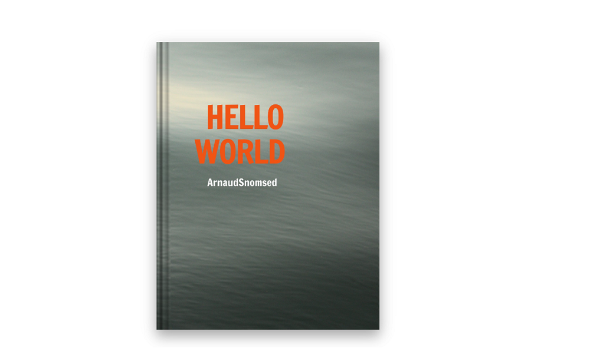
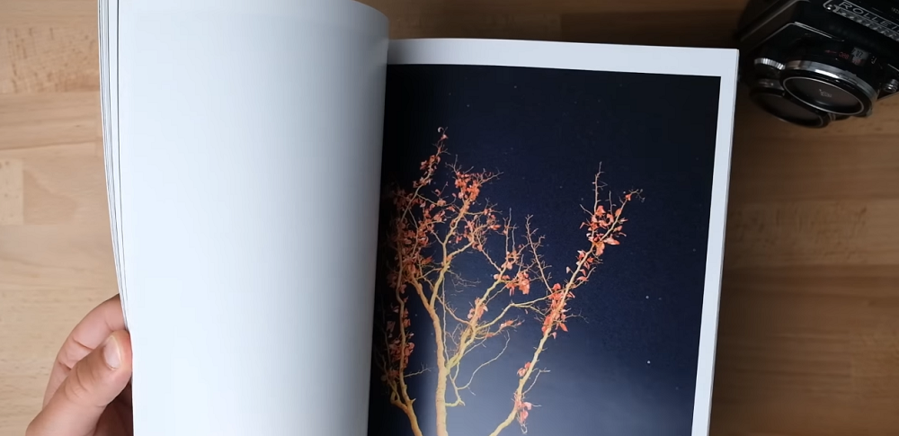
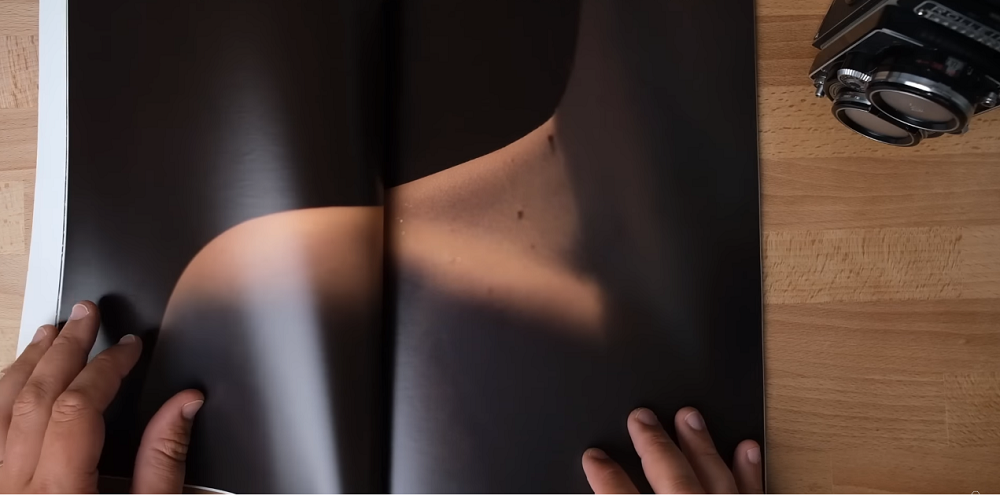
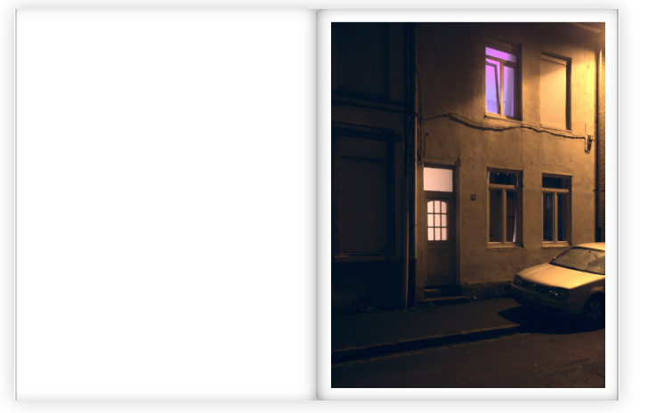

### Caractéristiques

- Format : Lettre US, 22×28 cm
- Nombre de pages: 80 (40 photos)
- Couverture souple

### Introduction

Ce zine est la materialisation de mon projet "Hello World". Cette série de 40 photographies a été prise pendant trois années dans un style "réalisme magique", une période pendant laquelle la photographie m'a fait voyager intérieurement.

### Un monomythe

> Le photographe n'invente rien, il imagine tout - Brassaï

La série est construite comme le récit d'une quête. Le concept du monomythe (monomyth), développé par Joseph Campbell dans ses livres et ses conférences à partir de la fin des années 1940, avance l'idée que tous les mythes du monde racontent essentiellement la même histoire, dont ils ne seraient que des variations. Selon cette thèse, tous les mythes seraient liés à notre imaginaire en tant que manifestations de notre quête de sens.

### Origine du titre

Quand on apprend à programmer, l'un des premiers exercices est généralement d'imprimer à l'écran le message "Hello world" donnant alors l'impression de communiquer avec un autre monde.
Cette série est donc l'occasion d'explorer le monde qui est en nous. 

### Recommandations

> Votre "boulot" est très bon ! Vous êtes un peintre dans l'âme.

Franck Gérard

> Cette série est énigmatique (...) Même si on ne sait pas où l'on va, on est transporté dans cette ambiance.

Paul Napo

Pour plus de détails sur Hello World, j'en parle aussi sur cette chaine :

<iframe width="90%" height="300" src="https://www.youtube.com/embed/4ooAYXZDruc" title="YouTube video player" frameborder="0" allow="accelerometer; autoplay; clipboard-write; encrypted-media; gyroscope; picture-in-picture; web-share" allowfullscreen></iframe>

